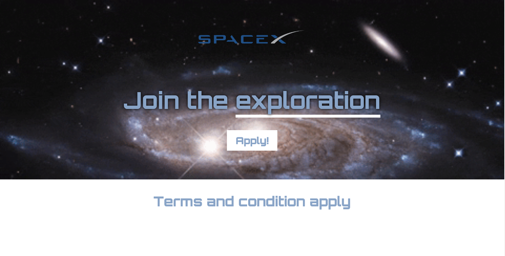

# Space Exploration

Welcome to the Space Exploration project! This project aims to provide an immersive experience into the wonders of outer space.

## Description

Embark on an exciting journey to explore the mysteries of the universe. From distant galaxies to exoplanets, uncover the wonders of space exploration.

## Lessons Learned

1. **Background Images**: Understanding how to effectively use background images to enhance the visual appeal of web pages.
2. **WebP Format**: Learning about the WebP image format and its advantages for web optimization and performance.
3. **Google Fonts**: Exploring the use of Google Fonts to enhance typography and improve the visual aesthetics of web pages.
4. ** Tag**: Understanding the  tag and its role in applying styles to specific parts of text within HTML elements.
5. **IDs and Utility Classes**: Learning to use IDs and utility classes to target specific elements and apply styling or functionality.
6. **Text Shadow**: Exploring the text-shadow property in CSS to add depth and dimension to text elements.

## Technologies Used

- HTML
- CSS

## Installation

1. Clone this repository: `git clone https://github.com/your-username/space-exploration.git`
2. Open `index.html` in your web browser.

## Live Demo

Experience the excitement of space exploration in our live demo: [View Live Demo](https://space-exploration-site-omega.vercel.app/)

## Contributing

Contributions are welcome! If you have any suggestions for improvement or would like to add new features, please open an issue or submit a pull request.

## License

This project is licensed under the [MIT License](LICENSE).
